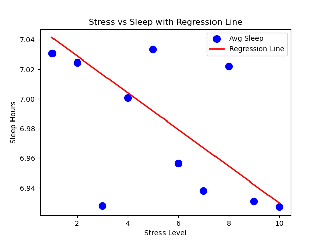

# SleepMetrics
> Predicting sleep duration from stress levels using Simple Linear Regression — built from scratch, one feature at a time.

---

## Dataset
- **Source:** [Sleep Cycle & Productivity — Kaggle](https://www.kaggle.com/datasets/adilshamim8/sleep-cycle-and-productivity)
- **Total rows:** 5000 → 3146 after cleaning
- **Input (X):** `Stress Level` (1–10)
- **Output (Y):** `Total Sleep Hours`

---

## Project Structure
```
SleepMetrics/
├── load_data.py           # Load & explore dataset
├── preprocess_data.py     # Remove nulls & duplicates, save clean CSV
├── train.py               # Train model & save as .pkl
├── visual3.py             # Best visualization graph
├── predict.py             # User inputs stress → get sleep prediction
├── clean_data.csv         # Cleaned dataset
└── sleepcyclemodel.pkl    # Saved trained model
```

---

## Model
```
Algorithm  : Simple Linear Regression
Formula    : Sleep Hours = -0.0124 × Stress Level + 7.05
Train/Test : 80% / 20%
```

---

## How to Run
```bash
python load_data.py
python preprocess_data.py
python train.py
python visual3.py
python predict.py
```

---

## Requirements
```bash
pip install pandas scikit-learn matplotlib numpy
```

---

## Visualization

> Average sleep hours per stress level with regression line — clearly shows higher stress = less sleep

---

## Prediction Example
```
Enter your stress level (1-10): 7
You should sleep around 6.97 hours tonight!

Enter your stress level (1-10): 1
You should sleep around 7.04 hours tonight!
```

---
